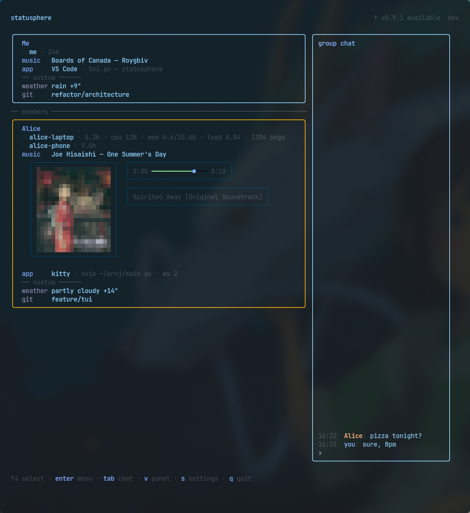
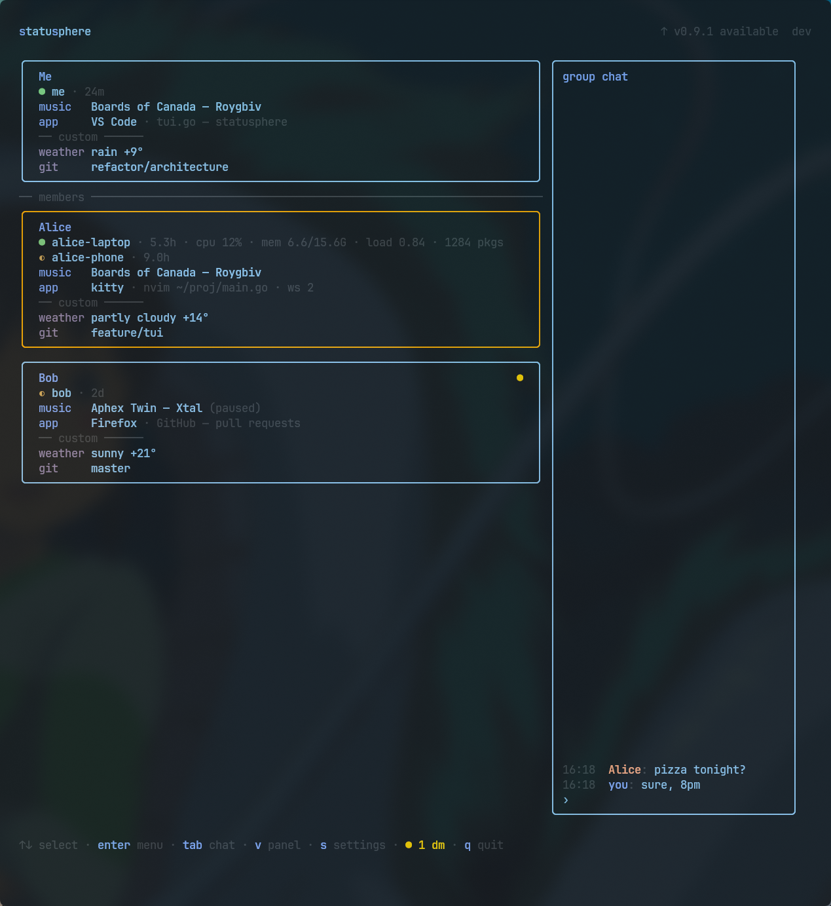

# Statusphere

A little presence thing for a small group of friends: who's online, what they're listening to, which app they're in. Runs in the terminal, no server to babysit beyond the one binary.

Started as "I want a Discord-style status bar without Discord" and grew an incognito mode, screen time, and a chat tab along the way.

## Install

```bash
curl -sSL https://raw.githubusercontent.com/MAX1T1A/statusphere/master/install.sh | bash
```

Drops the binary in `~/.local/bin/` and adds an `sstatus` alias. Open a new terminal (or `source ~/.bashrc` / `source ~/.zshrc`) afterward.

Linux only for now.

## First run

```bash
sstatus --register https://ss.example.com
```

Creates an account and a room, you're the owner of both. Then just:

```bash
sstatus
```

## Getting friends in

```bash
sstatus --invite    # prints an invite code, your server is baked into it, good for an hour
```

Whoever you send it to runs:

```bash
sstatus --join <invite>
sstatus
```

Their account gets created on your server automatically - no separate signup step.

## A second device for yourself

```bash
sstatus --new-device                              # on the device you already have, prints a link code
sstatus --link https://ss.example.com --code <code>   # on the new one
```

Lands in the same room as your first device.

## Account upkeep

```bash
sstatus --set-name "Name"       # what shows up on your card
sstatus --devices               # your devices
sstatus --revoke <device_id>    # cut one off
sstatus --members               # who's in the room
sstatus --kick <account_id>     # owner only
```

If you lose every device, recover with the `account_id` and `account_secret` printed at registration:

```bash
sstatus --recover https://ss.example.com --account <account_id> --secret <account_secret>
```

## Incognito

For when you'd rather the room not see what's open on your screen right now.

```bash
sstatus --incognito on
sstatus --incognito 45m
sstatus --incognito on --note "on a call"
sstatus --incognito off
sstatus --incognito status
```

You're still in the room, still playing music, apps just don't show. Friends see "off the radar" or your note instead. Same switch is in the menu under `s → Incognito`.

The filter runs before anything leaves your machine - hidden stuff never reaches friends or the server, screen time for that window is just blank. Sanity-check what actually gets sent:

```bash
sstatus --published
```

Config is `~/.config/statusphere/privacy.json`, one profile for normal and one for incognito:

```json
{
  "profiles": {
    "normal": {
      "apps": "full",
      "music": "full",
      "system": "on",
      "custom": "on"
    },
    "incognito": {
      "apps": "off",
      "music": "full",
      "system": "on",
      "custom": "on"
    }
  },
  "hide_apps": ["(?i)keepassxc", "(?i)1password", "(?i)bitwarden"]
}
```

- `apps` - `full` (app + window title), `app` (app only), `busy` (just "Active"), or `off`
- `music` - `full`, `listening` (playing, but not what), or `off`
- `system`, `custom` - `on` or `off`
- `hide_apps` - regexes against app name and window title, active all the time, not just in incognito. Password managers and banking apps stay hidden even while you're visible.
- `announce` - `true` by default, so friends see you went hidden rather than a frozen card. Set `false` for no explanation at all.

## Interface

<table><tr>
<td></td>
<td></td>
</tr></table>

- `↑ ↓` pick someone, `Enter` opens their menu: music, screen time, sync track, direct message
- `v` switch the side panel between chat and today's screen time board, `tab` jump into the chat to type
- `s` settings: check for updates, incognito, rename this device, quit
- `x` remove someone from the room (owner only), `q` quit, `Esc` back out of a panel

It checks for new releases on startup and can install them itself from the menu (also under `s`).
