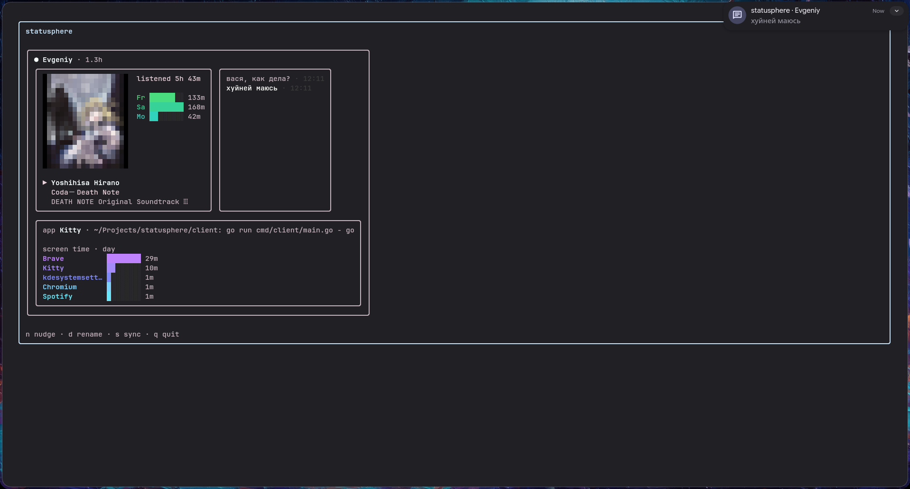

# Statusphere

Утилита для обмена присутствием между друзьями в реальном времени. Видишь что слушают, в каком приложении сидят, сколько онлайн. Работает как TUI прямо в терминале.

## Как это выглядит



Каждый клиент собирает информацию о системе, отправляет на общий сервер по WebSocket и отображает всех подключённых друзей в виде карточек.

## Возможности

**Присутствие и системная информация**
- Статус онлайн/idle/офлайн с цветным индикатором
- Аптайм системы
- Активное приложение и заголовок окна (Hyprland)

**Spotify**
- Текущий трек: исполнитель, название, альбом + пиксельная обложка (half-block рендеринг)
- Статистика прослушивания за неделю с графиком по дням
- Синхронизация — нажми `s` чтобы послушать тот же трек что и друг (через D-Bus)

**Экранное время**
- Бары использования приложений за день (данные с сервера `/stats/summary`)
- Градиентная цветовая палитра (purple → cyan)
- Кэш per-device с фоновым обновлением

**Сообщения (Nudge)**
- Нажми `n` чтобы отправить сообщение всем в комнате
- Сообщения отображаются внутри карточки отправителя рядом с блоком Spotify
- Десктопные уведомления через `notify-send`
- История чата с временными метками, свои сообщения выделены серым

**Управление устройством**
- Уникальный ID хранится в `~/.config/statusphere/device_id`
- Переименование через `d` — сохраняется в `~/.config/statusphere/device_name`

## Архитектура

```
collector/       Провайдеры данных (подключаются в зависимости от ОС/DE/дистрибутива)
  linux/         Linux: uptime, spotify, cpu, memory, battery, wifi, weather
    arch/        Arch Linux: количество пакетов
    hyprland/    Hyprland: активное окно, воркспейс
    spotify/     Spotify через D-Bus MPRIS

detector/        Автоопределение ОС, дистрибутива, DE/WM, терминала

transport/       WebSocket клиент с автореконнектом, идентификация устройства

watcher/         Поллит коллекторы, сравнивает снапшоты, шлёт при изменении
                 InjectOnce() — одноразовые поля в следующий снапшот (nudge)

feed/            Агрегирует входящие данные устройств из WebSocket

stats/           Интерфейс Fetcher + per-device Cache (async, stale-while-revalidate)
  spotify.go     Статистика прослушивания Spotify
  summary.go     Статистика использования приложений

renderer/
  tui/           BubbleTea TUI с карточным лейаутом
    block_header    Статус, имя, аптайм, батарея, wifi, погода
    block_spotify   Обложка, текущий трек, недельный график
    block_app       Активное приложение, бары экранного времени
    block_nudge     История сообщений per-device
  noop/          Headless режим (без UI, только сбор и отправка)

notifier/        Десктопные уведомления через notify-send

models/          Тип Snapshot (map[string]any)
```

### Добавить новый провайдер

Создай файл в `collector/linux/`, который возвращает `func(models.Snapshot)`:

```go
package linux

import "statusphere-client/internal/models"

func MyProvider() func(models.Snapshot) {
    return func(snap models.Snapshot) {
        snap["my_key"] = "my_value"
    }
}
```

Зарегистрируй его в `cmd/client/main.go` внутри `buildProviders()`.

### Добавить новую статистику

Создай файл в `stats/`, реализующий интерфейс `Fetcher`:

```go
package stats

import "net/url"

type MyData struct { /* ... */ }

type myFetcher struct{}

func (f myFetcher) Path() string                    { return "/stats/my-endpoint" }
func (f myFetcher) Query(deviceID string) url.Values { /* ... */ }
func (f myFetcher) New() any                         { return &MyData{} }

func NewMyCache(serverURL, token string) *Cache {
    return NewCache(serverURL, token, myFetcher{})
}
```

## Требования

- Go 1.25+
- Linux (провайдеры используют `/proc`, `/sys`, D-Bus)
- Hyprland (для активного окна/воркспейса — опционально)
- Десктопный Spotify (для текущего трека / синхронизации — опционально)
- Запущенный сервер Statusphere

## Запуск

```bash
cd client
go build -o statusphere ./cmd/client

# TUI режим (по умолчанию)
./statusphere

# Headless режим (только сбор и отправка, без UI)
./statusphere -ui headless
```

## Горячие клавиши

| Клавиша | Действие |
|---------|----------|
| `n` | Отправить сообщение всем в комнате |
| `d` | Переименовать устройство |
| `s` | Синхронизировать трек Spotify с другом |
| `q` | Выход |
| `Esc` | Отменить ввод |

## Конфигурация

URL сервера и токен комнаты задаются в `cmd/client/main.go`:

```go
const (
    serverURL = "https://your-server-url.com"
    roomToken = "your-room-token"
)
```

Идентификация устройства хранится в `~/.config/statusphere/`:
- `device_id` — уникальный идентификатор (генерируется автоматически)
- `device_name` — отображаемое имя (задаётся через `d` или переменную `DEVICE_NAME`)